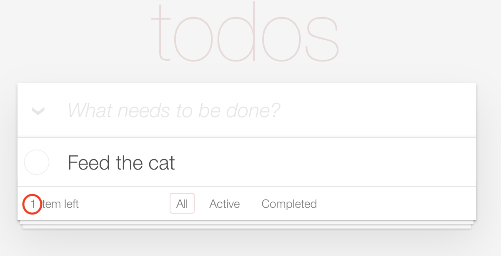

# Serenity BDD Screenplay Tutorial

The aim of this tutorial is to learn how to use Cucumber and Serenity Screenplay to write expressive, highly maintainable executable specifications.
The application under test will be the TodoMVC application.

## Runner classes

Serenity Cucumber tests need runner classes to run them. You can see an example of in [SiteLayout.java](src/test/java/todo/acceptancetests/SiteLayout.java):

```java
@RunWith(CucumberWithSerenity.class)
@CucumberOptions(
        plugin = {"pretty"},
        features = "src/test/resources/features/site_layout/site_title_and_credits.feature",
        glue = "todo"
)
public class SiteLayout {}
```

Each time you work with a new feature file, create a new runner class with the corresponding path so that you can run your tests in isolation.
This will also make it easier to run all of the tests in parallel.

## Lesson 1

The first Cucumber scenario we will work on can be found in the [site_title_and_credits.feature](src/test/resources/features/layout/site_title_and_credits.feature) feature file.

The scenario is a simple one:
```gherkin
  Scenario: The application credits should appear in the footer
    When Todd opens the Todo Application
    Then he should see the credits in the footer
```
The first step has already been implemented for you. 
If you open the [StepDefinitions](src/test/java/todo/stepdefinitions/StepDefinitions.java) class, you can see how it works.


# Lesson 2 - check the site title

Next, we will implement the other pending scenario in the [site_title_and_credits.feature](src/test/resources/features/site_layout/site_title_and_credits.feature) feature file:

```gherkin
  Scenario: The page title should be shown
    When Todd opens the Todo Application
    Then the page title should include "TodoMVC"
```

## Lesson 3 - checking the prompt message

The next scenario we will work on can be found in the [adding_new_todos.feature](src/test/resources/features/creating_todos/adding_new_todos.feature) feature file.

```gherkin
  Scenario: User should be assisted when adding todo items for the first time
    Given Trudy has not entered any todo items
    Then the application should suggest how to add them
```

In this scenario, we check that the "What needs to be done?" message in the input box is correctly displayed:


**HINT**: You can use the `Ensure.that(...).attribute()...` method.

## Lesson 4 - adding a single item

The next scenario to implement involves adding a single item to the list, and checking the contents of the list.

```gherkin
  Scenario: Adding a single todo item
    Given Trudy has not entered any todo items
    When she adds "Walk the dog"
    Then her todo list should contain:
      | Walk the dog |
```

**HINT**: You will need to create a new `AddATodoItem` task class and use the `Task.where(...)` method. 
You can also use the `Ensure.that(...).textValues()` method to make assertions about a list of matching values.

## Lesson 5 - Starting with a list that already contains some items

In the next lesson, we will implement a scenario that starts with a list that already contains entries:

```gherkin
  Scenario: Adding todo items to an existing list
    Given Trudy has a todo list containing
      | Feed the cat |
    When she adds "Walk the dog"
    Then her todo list should contain:
      | Feed the cat |
      | Walk the dog |
```

**HINT**: Create an `AddTodoItems` task class that uses the `AddTodoItem` class.

## Lesson 6 - Completing tasks

In lesson 6, we look at a new feature,  [completing_todos.feature](src/test/resources/features/completing_todos/completing_todos.feature) feature file.

```gherkin
  Scenario: Completed todos should no longer appear in the active todo list
    Given Trudy has a todo list containing
      | Feed the cat |
      | Walk the dog |
    When she completes "Walk the dog"
    Then the todo item called "Walk the dog" should be marked as completed
```

**HINT**: Create a new `CompleteTodoItem` task class. You may need to use a parameterized `Target` field.

## Lesson 7 - Refactoring using Question classes

The `Then` step in the previous lesson contained a direct reference to a particular CSS class. 
This is not ideal, as it could lead to duplication if other steps need to query the status of a task.
A better approach would be to split out the check into separate classes.

**HINT**: Create an enum class to model the todo status values, and a `Question` class to return the current status of a given todo item.

## Lesson 8 - Filtering tasks

The next scenario is in the [filtering_todos.feature](src/test/resources/features/managing_todos/filtering_todos.feature) feature file:

```gherkin
  Scenario Outline: Should be able to view only completed todos
    Given Trudy has a todo list containing
      | Feed the cat |
      | Walk the dog |
    When she completes "Walk the dog"
    And she filters the list to show <Filter> tasks
    Then her todo list should contain:
      | <Item Displayed> |

    Examples:
      | Filter    | Item Displayed |
      | Completed | Walk the dog   |
      | Active    | Feed the cat   |
```

## Lesson 9 - deleting a task

This exercise involves implementing a scenario [deleting_todos.feature](src/test/resources/features/managing_todos/deleting_todos.feature) feature file:

```gherkin
  Scenario: Deleted todos should be removed entirely from the list
    Given Trudy has a todo list containing
      | Feed the cat |
      | Walk the dog |
      | Buy the milk |
    When she deletes "Walk the dog"
    Then her todo list should contain:
      | Feed the cat |
      | Buy the milk |
    And the number of items left should be 2
```

**HINT**: Clicking on the delete button is tricky - you will need to use the `JavaScriptClick` class to perform a JavaScript click.


## Lesson 10 - Checking the remaining count

The next exercise is to implement the second step of the deletion scenario: "And the number of items left should be 2". 



**HINT**: You can use `Ensure.that(...).text().asAnInteger()` to compare integer values directly.

## Lesson 11 - comparing item counts

In this lesson we will refactor the [adding_new_todos.feature](src/test/resources/features/managing_todos/deleting_todos.feature) 
feature file to check the complete number of items left message:

```gherkin
  Scenario: Adding a single todo item
    Given Trudy has not entered any todo items
    When she adds "Walk the dog"
    Then her todo list should contain:
      | Walk the dog |
    And the remaining item count should show "1 item left"

  Scenario: Adding todo items to an existing list
    Given Trudy has a todo list containing
      | Feed the cat |
    When she adds "Walk the dog"
    Then her todo list should contain:
      | Feed the cat |
      | Walk the dog |
    And the remaining item count should show "2 items left"
```

## Lesson 12 - Updating a todo entry

In this lesson we will see how to modify an existing entry.  
The scenario is in the [updating_todos.feature](src/test/resources/features/managing_todos/updating_todos.feature) feature file:

```gherkin
  Scenario: Should be able to update the name of a task
    Given Trudy has a todo list containing
      | Feed the cat |
      | Walk the dog |
    When she updates "Walk the dog" to "Walk Fido"
    Then her todo list should contain:
      | Feed the cat |
      | Walk Fido |
```

## Want to learn more?
For more information about Serenity BDD, you can read the [**Serenity BDD Book**](https://serenity-bdd.github.io/theserenitybook/latest/index.html), the official online Serenity documentation source. Other sources include:
* **[Byte-sized Serenity BDD](https://www.youtube.com/channel/UCav6-dPEUiLbnu-rgpy7_bw/featured)** - tips and tricks about Serenity BDD
* [**Serenity BDD Blog**](https://johnfergusonsmart.com/category/serenity-bdd/) - regular articles about Serenity BDD
* [**The Serenity BDD Dojo**](https://serenitydojo.teachable.com) - Online training on Serenity BDD and on test automation and BDD in general. 
